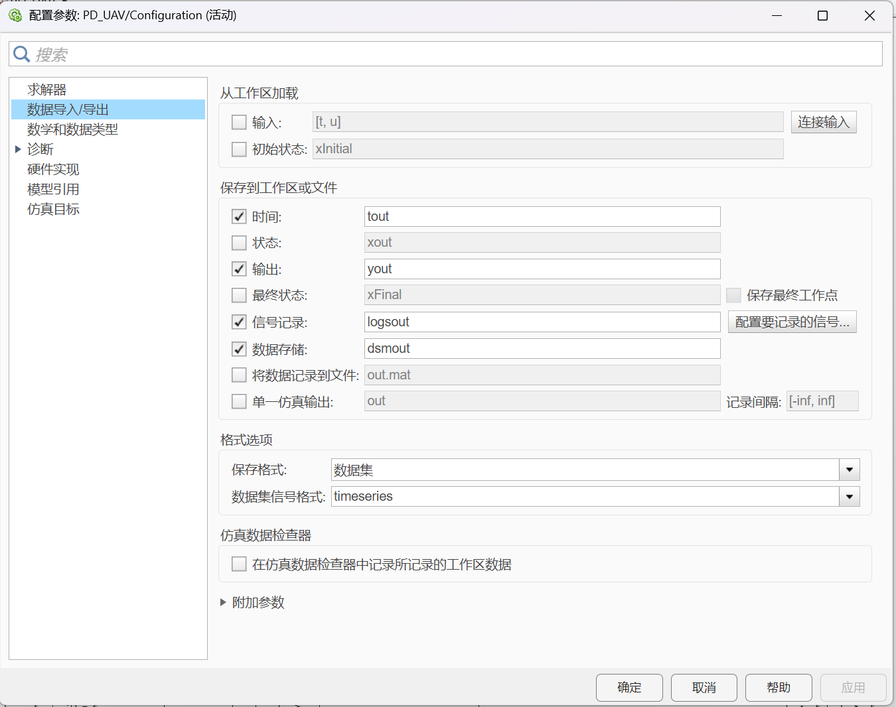

# 四旋翼无人机 MATLAB/Simulink 仿真说明
-------------------------------------

### 本项目为基于 MATLAB/Simulink 的四旋翼无人机非线性控制系统仿真。

# 运行步骤如下：

1. 请确保以下文件位于同一目录下：

   - PD_UAV.slx
   - uav.m

2. 首先打开 MATLAB。

3. 在 MATLAB 当前工作目录中进入本项目文件夹。

4. 双击打开：

   s_uav.slx

*且在 Simulink 上方設定栏點建模， 進入模型設置，出現窗口后點左側的數据导入/导出，把其單一仿真*
*取消，把格式选項改成數據集，timeseries*

5. 运行 Simulink 模型。

6. Simulink 仿真结束后，再运行：

   uav.m

7. 运行完成后，将显示：

   - 四旋翼无人机三维运动动画
   - z 轴高度响应曲线

## 注意事项：
-------------------------------------

1. 若文件不在同一目录下，MATLAB 可能无法正确读取仿真数据。

2. 请确保 MATLAB 已安装：

   - Simulink
   - Robotics System Toolbox

3. 若动画运行较慢，可适当减少仿真步数或增大 pause 时间。

作者：chipeng0412
-------------------------------------

本项目用于课程设计与无人机控制系统学习研究。